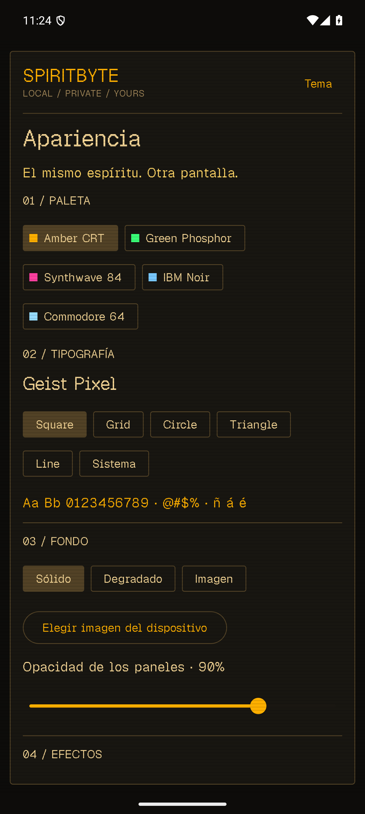
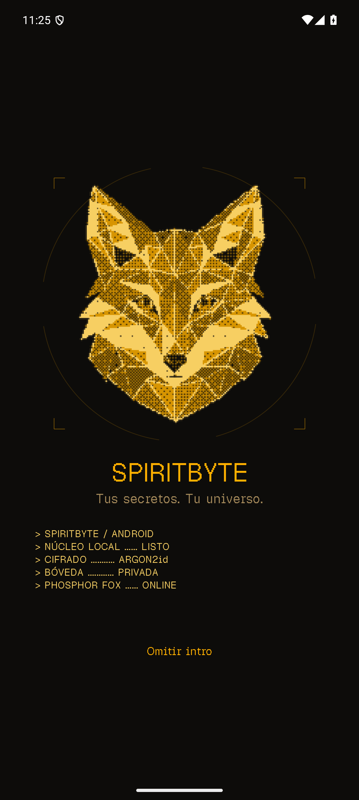

<p align="center">
  
</p>

<h1 align="center">SpiritByte Android</h1>
<p align="center">An offline password manager for Android, built with Kotlin, Jetpack Compose and Rust.</p>

SpiritByte keeps your credentials in an encrypted vault on your device. Create folders, generate passwords, customize the interface and transfer encrypted backups between Android and desktop. No account or server is required, and the app does not request Internet access.

**Current version:** 0.3.0-dev. **Compatibility:** Android 8.0 or later, ARM64 and x86_64.

## Desktop version

SpiritByte Android is the mobile companion to [SpiritByte Desktop](https://github.com/OscarTired/SpiritByte-V2). Both versions use the same Rust vault engine and support encrypted `.spiritbyte` backups, including folder structure, icons and colors.

<a href="https://github.com/OscarTired/SpiritByte-V2">
  
</a>

**[Explore SpiritByte Desktop](https://github.com/OscarTired/SpiritByte-V2)**

Backup transfer is manual; automatic synchronization is not implemented.

## Features

- Local encrypted vault protected by a master password and a 12-word recovery phrase.
- Create, edit, search and favorite credentials; generate passwords with the Rust engine.
- Folders and subfolders with 22 icons, custom colors and credential filtering.
- Encrypted backup import and export, compatible with desktop.
- Automatic locking when the app enters the background and after two minutes of inactivity.
- Screenshot protection and exclusion of the vault from Android automatic backups.
- Bundled Geist Pixel fonts, five color palettes, CRT scanlines and adjustable panel opacity.
- Solid, gradient or custom image backgrounds, plus the original animated fox intro.

Deleting a folder preserves its credentials. Folder icons, colors and hierarchy are also retained when importing a backup.

## Preview

<p>
  
  
</p>

## Build on Windows

### Requirements

- JDK 17 or a compatible Android Studio JDK, with `JAVA_HOME` configured.
- Rust with the MSVC toolchain and Visual Studio C++ build tools.
- Android SDK Platform 34, Build Tools 34.0.0 and NDK 28.2.13676358.
- Git. Gradle 8.7 is provided through the wrapper.

```powershell
git clone https://github.com/OscarTired/SpiritByte-Android.git
cd SpiritByte-Android
rustup target add aarch64-linux-android x86_64-linux-android
cargo install cargo-ndk --version 4.1.2 --locked
```

Set `ANDROID_SDK_ROOT` to your SDK directory and create an untracked `local.properties` file pointing to that same SDK. For example:

```powershell
$env:ANDROID_SDK_ROOT = 'C:\Android\Sdk'
'sdk.dir=C:/Android/Sdk' | Set-Content local.properties
.\scripts\build.ps1
```

The build generates UniFFI Kotlin bindings, compiles the Rust library for both Android architectures, builds the application and runs Android lint. The APK is copied to:

```text
instalador/SpiritByte-Android.apk
```

Install this APK to run **SpiritByte** (`com.spiritbyte.android`). The `app-debug-androidTest.apk` file is only a test package and has no launcher icon.

The output is a debug-signed development build. Updating an existing installation requires the same signing key; keep your encrypted backup before changing build environments. When using the same key, install over the existing app to preserve its vault.

To work in Android Studio, first run `scripts/build-native.ps1`, then open this repository. Generated Kotlin bindings and native libraries are not tracked in Git and should not be edited manually. After generating them, `scripts/build.ps1 -SkipNative` rebuilds the Android interface without rebuilding Rust.

The desktop checkout is not required for a normal Android build. Fonts, icons and artwork are already included. Optional asset-import scripts expect a sibling checkout named `SpireByte-V2`; font conversion additionally requires Python `fonttools` and `brotli`, and icon conversion requires the desktop Node dependencies.

## Backups and recovery

Choose a separate backup password when exporting a `.spiritbyte` file. The vault recovery phrase cannot unlock an exported backup.

To import, choose the file, unlock the vault again if requested, and enter the backup password. Imported records receive new IDs and are added to the destination vault; importing the same backup twice creates duplicates. Visual preferences and wallpapers are not included.

Write down the recovery phrase before leaving its screen. It is shown once during setup. Opening Android's document picker locks the vault; export retains only encrypted backup data while that picker is open.

## Architecture

```text
app/       Jetpack Compose UI, lifecycle handling and Android document access
core/      Shared Rust encryption, vault, backup and password-generation engine
native/    UniFFI bridge, serialized sessions and transactional mutations
scripts/   Windows build tools and optional desktop asset conversion
```

The Rust core was extracted from SpiritByte Desktop while preserving its data formats. This repository contains the engine needed to build Android independently. The current desktop source uses a sibling path dependency on `SpiritByte-Android/core`.

## Security and development status

The app stores vault files in its private Android storage. Encryption uses Argon2id key derivation and XChaCha20-Poly1305 authenticated encryption. Backups are encrypted before being handed to Android's document picker.

The vault data encryption key is managed in Rust. Displayed credentials and entered passwords also exist in Android-managed memory, so guaranteed erasure of Kotlin strings is not claimed. Locking clears the visible session and prevents late background results from reopening it.

This is a development version. Biometric unlock, Android autofill and automatic synchronization are not implemented. Physical-device performance and memory validation remain pending. Publishing to an app store requires release signing and a review of its current target SDK requirements.

## Verification

```powershell
cargo test --manifest-path core/Cargo.toml
cargo test --manifest-path native/Cargo.toml --lib
.\gradlew.bat :app:lintDebug :app:assembleDebug
# With a connected emulator or test device:
.\gradlew.bat :app:connectedDebugAndroidTest
```

The instrumented tests exercise the real native library using temporary vaults, covering persistence, locking, recovery, backups and folder behavior. See [VALIDATION.md](VALIDATION.md) for recorded results and remaining checks.

## License

SpiritByte Android is released under the [MIT License](LICENSE). Bundled font and icon licenses are included in [app/src/main/assets/licenses](app/src/main/assets/licenses).
